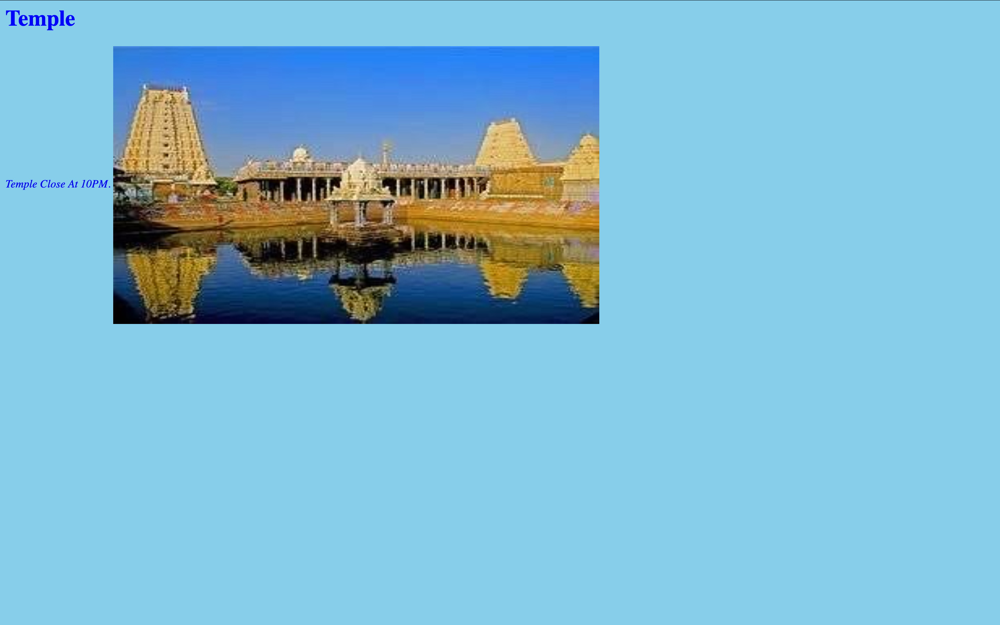

# Ex04 Places Around Me
## Date: 25/04/2025

## AIM
To develop a website to display details about the places around my house.

## DESIGN STEPS

### STEP 1
Create a Django admin interface.

### STEP 2
Download your city map from Google.

### STEP 3
Using ```<map>``` tag name the map.

### STEP 4
Create clickable regions in the image using ```<area>``` tag.

### STEP 5
Write HTML programs for all the regions identified.

### STEP 6
Execute the programs and publish them.

## CODE
home.html
```
<!-- Image Map Generated by http://www.image-map.net/ -->


<map name="image-map">
    <area target="" alt="kamatchi temple" title="kamatchi temple" href="temple.html" coords="713,589,933,492" shape="rect">
    <area target="" alt="grt" title="grt" href="jewels.html" coords="457,125,71" shape="circle">
    <area target="" alt="darling" title="darling" href="electronics.html" coords="1015,320,1071,320,1123,350,1125,391,1113,440,1081,450,1021,438,987,381,980,343" shape="poly">
</map>
```
jewels.html
```
<html>
    <head><h1>jewels</h1></head> 
    <title>Kutty</title>
    <body text="blue" bgcolor="skyblue">
        <i>Money Speaks Hear</1>
         
    </body> 
</html>
```
electronics.html
```
<html>
    <head><h1>Electronics</h1></head> 
    <title>Kutty</title>
    <body text="blue" bgcolor="skyblue">
        <i>Every Thing Available Hear</1>
         
    </body> 
</html>
```
temple.html
```
<html>
    <head><h1>Temple</h1></head> 
    <title>Kutty</title>
    <body text="blue" bgcolor="skyblue">
        <i>Temple Close At 10PM.</1>
         
    </body> 
</html>
```


## OUTPUT





## RESULT
The program for implementing image maps using HTML is executed successfully.
